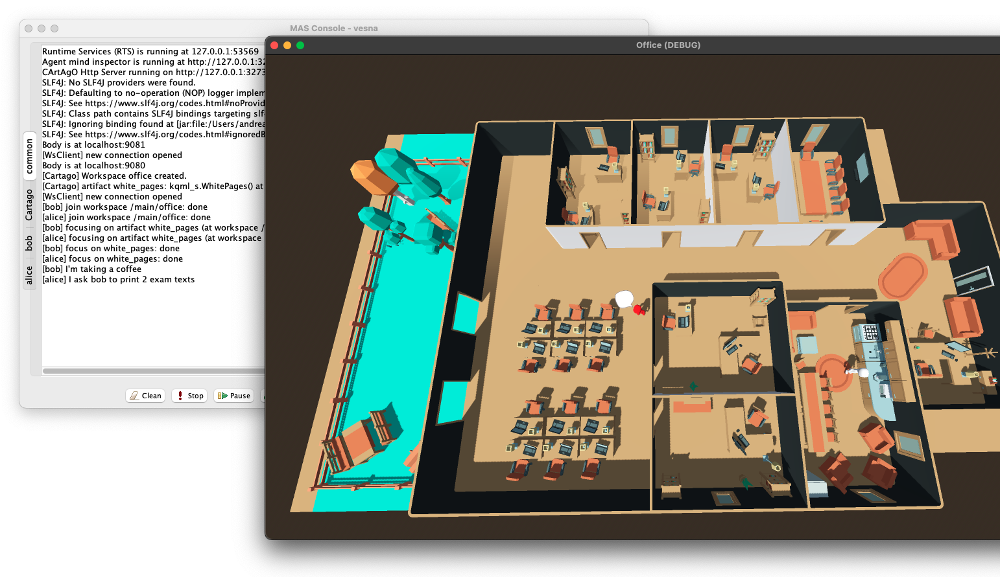
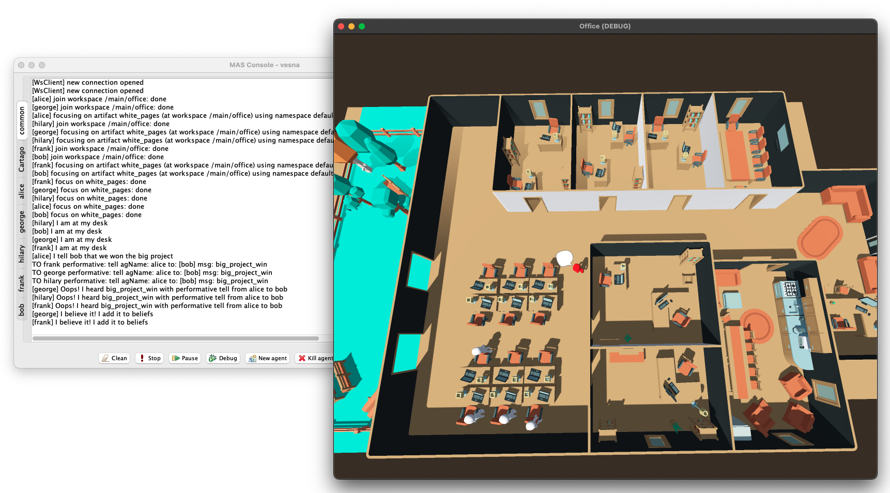
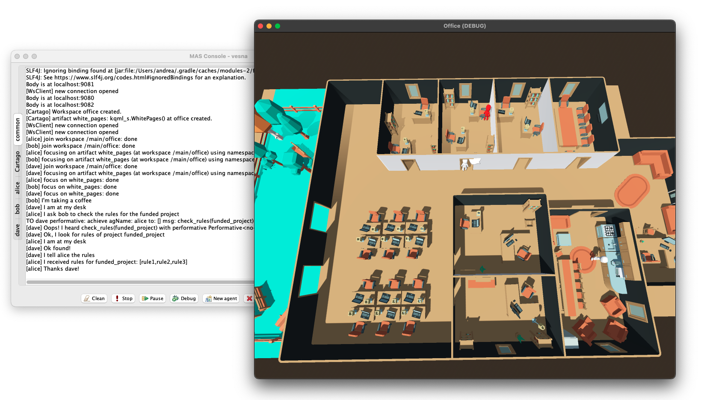
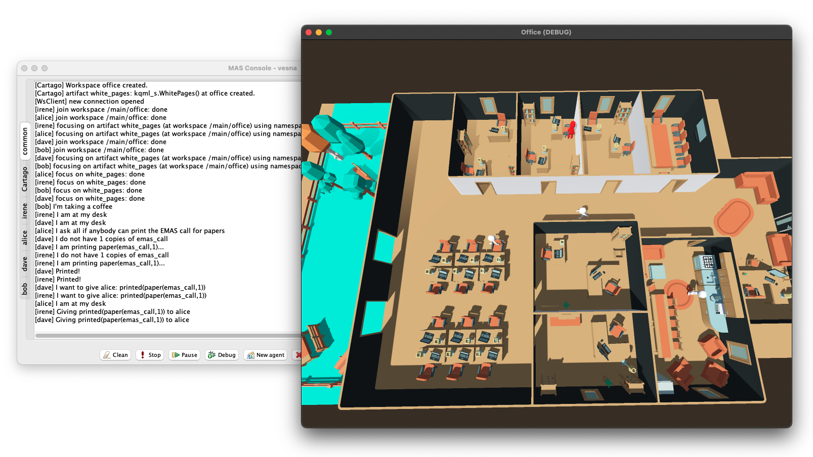

# KQML-S: Situated KQML Communication

| Scenario 1                    | Scenario 2                    |
| ----------------------------- | ----------------------------- |
|  |  |

| Scenario 4                    | Scenario 5                    |
| ----------------------------- | ----------------------------- |
|  |  |

