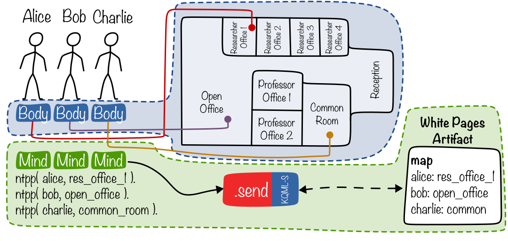

# KQML-S: Situated KQML Communication

**KQML-S** is an extension of KQML to consider situatedness implemented inside the **VEsNA** framework.

VEsNA framework provides a connection between JaCaMo agents and Godot bodies creating embodied agents. These agents can move in physical environments  and thus are situated always inside rooms or regions.

KQML-S adds the concept of situatedness to conversations making possible only conversation inside the same room or region and making the other agents perceive the noise of messages that are not directly sent them.

## Usage

> [!IMPORTANT]
>
> **Requirements**
>
> - Java 23 (if you change version remember to change it in the `build.gradle` file);
> - Gradle;
> - Godot 4 (optional, only for examples).

The framework provides:

- A new `.send` internal action for the agent;
- A `WhitePages` artifact;

The structure of the project should follow this:

```
├── build.gradle
├── your_mas.jcm
└── src
    ├── agt
    │   ├── agent_1.asl
    │   ├── ...
    │   ├── agent_n.asl
    │   │
    │   ├── kqml_s
    │   │   ├── send.java
    │   └── kqml_s.asl
    └── env
        ├── your_classes.java
        └── WhitePages.java
```

Inside the `src/agt` folder the `kqml_s` folder contains the new `InternalAction` send. The `WhitePages.java` inside `src/env` instead provides locality to agents.

### Make an agent KQML-Situated

When including the KQML-S inside your project these are the three main concepts to address:

- `agt/kqml_s/send.java`: the new `DefaultInternalAction` for the sends. To use it inside your agent it is sufficient to call

  ```prolog
  kqml_s.send( Mode, Performative, Receiver, Msg, [Answer], [Timeout] ).
  
  kqml_s.send( public, tell, alice, hello ). // This sends 'hello' to alice publicly (all other agents are notified)
  kqml_s.send( private, askOne, bob, value(beer, X) ). // This asks 'value(beer, X)' to bob privately (nobody can hear)
  ```

- `env/WhitePages.java`: an environmental artifact on which all the agents must focus containing a map of agents positions; it provides the following API:

  ```prolog
  kqml_s.update_location( AgName, Location ).
  kqml_s.get_location( AgName, Location ).
  
  // Example of update
  +ntpp( Me, Region )
  	:	.my_name( Me )
  	<-	kqml_s.update_location( Me, Region ).
  ```

- Additionally to these two files a third one is provided: `agt/kqml_s.asl`. This file is just a prototype and needs to be modified according to your agent implementation. It must implement:

  - the update of agent region inside WhitePages artifact: you must have a plan or a triggering event that calls the `kqml_s.update_location`;

  - triggering events for heard messages in the form:

    ```prolog
    +notify( Performative, Receiver, Msg )[ source( Sender ) ]
    ```

    With this triggering events you can plan how your agent will react to heard messages.

The `.jcm` file should look like this:

```jcm
mas hello_world {

	agent alice:alice.asl {
		focus: white-pages
	}
	
	agent bob:bob.asl {
		focus: white-pages
	}
	
	workspace hello_ws {
		artifact white-pages: kqml_s.WhitePages
	}
}
```

> [!CAUTION]
>
> `kqml_s.send` **does not overwrite** the standard `.send` that is still available to agents! `.send` will work as usual without the spatial concepts.

> [!IMPORTANT]
>
> Remember to carefully set the **update of the WhitePages** artifact, otherwise it will not work as expected!

> [!CAUTION]
>
> Artifact **must** be shared between agents. Best way is to declare it in the workspace. If you need to create the Artifact during the execution be sure to create only one and focus all agents on it.


## Examples

The VEsNA office playground has been used as test scenario for the experiments.

You have to:

1. launch Godot;
2. import and launch the project;
3. select the scenario;
4. open a terminal and go to the corrisponding scenario folder inside examples;
5. launch the mas with `gradle run`.



| Scenario 1                                                   | Scenario 2                                                   |
| ------------------------------------------------------------ | ------------------------------------------------------------ |
|                                 |                                 |
| Alice (red agent) asks Bob (white agent) to print two copies of the exam. The request is heard by nobody. | Alice (red agent) tells Bob (one of the white agents) they won a big project. The message is heard also by Frank, George and Hilary who are in the room. As shown in the MAS Console, Frank and George are credulous and they add the content to their belief base while Hilary does nothing. |
| **Scenario 4**                                               | **Scenario 5**                                               |
|                                 |                                 |
| Alice (red agent) tells Bob (the white agent in common room) to check the project rules. The message is heard by Dave that being altruistic decides to check the project rules and tell them to Alice. | Alice (red agent) requests \texttt{all} agents inside the office room to print EMAS call for papers. The message is received from Bob and Irene, and both print it. |

A special thanks to [Kenney](https://www.kenney.nl/) for the models!
